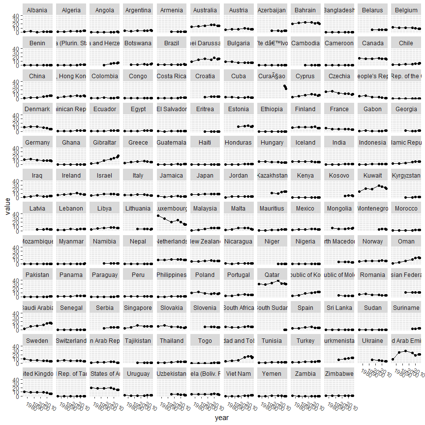

## Packages 


### Function for displaying colors  

```r
display_col <- function(colors){
  n <- length(colors)
  image(1:n, 1, as.matrix(1:n), col = colors)
}
```


## Data set 'Food'  

* Denoted as data set ´dat1´   


```r
dat1 <- read.csv("Env_Impact_Food_Production/Food_Production.csv") %>%
  clean_names()

tibble(dat1)

# dat1 %>%
#   pivot_longer(-food_product) %>%
#   ggplot(aes(x = food_product, fill = name, y = value)) +
#   geom_col()
```

```
## # A tibble: 43 x 23
##    food_product  land_use_change animal_feed  farm processing transport packging
##    <chr>                   <dbl>       <dbl> <dbl>      <dbl>     <dbl>    <dbl>
##  1 Wheat & Rye ~             0.1           0   0.8        0.2       0.1      0.1
##  2 Maize (Meal)              0.3           0   0.5        0.1       0.1      0.1
##  3 Barley (Beer)             0             0   0.2        0.1       0        0.5
##  4 Oatmeal                   0             0   1.4        0         0.1      0.1
##  5 Rice                      0             0   3.6        0.1       0.1      0.1
##  6 Potatoes                  0             0   0.2        0         0.1      0  
##  7 Cassava                   0.6           0   0.2        0         0.1      0  
##  8 Cane Sugar                1.2           0   0.5        0         0.8      0.1
##  9 Beet Sugar                0             0   0.5        0.2       0.6      0.1
## 10 Other Pulses              0             0   1.1        0         0.1      0.4
## # ... with 33 more rows, and 16 more variables: retail <dbl>,
## #   total_emissions <dbl>,
## #   eutrophying_emissions_per_1000kcal_g_p_oa_eq_per_1000kcal <dbl>,
## #   eutrophying_emissions_per_kilogram_g_p_oa_eq_per_kilogram <dbl>,
## #   eutrophying_emissions_per_100g_protein_g_p_oa_eq_per_100_grams_protein <dbl>,
## #   freshwater_withdrawals_per_1000kcal_liters_per_1000kcal <dbl>,
## #   freshwater_withdrawals_per_100g_protein_liters_per_100g_protein <dbl>, ...
```

## Data set 'GreenhouseGas'  

* Denoted as data set ´dat2´   


```r
dat2 <- read.csv("GreenhouseGas/GHG-Emissions-by-sector.csv") %>%
  clean_names()

tibble(dat2)
```

```
## # A tibble: 29 x 2
##    sub_sector        global_share
##    <chr>                    <dbl>
##  1 Road                      11.9
##  2 Aviation                   1.9
##  3 Rail                       0.4
##  4 Pipeline                   0.3
##  5 Ship                       1.7
##  6 Residential               10.9
##  7 Commercial                 6.6
##  8 Iron & Steel               7.2
##  9 Non-ferous metals          0.7
## 10 Machinery                  0.5
## # ... with 19 more rows
```


## Data set 'Env_Dataset_UNdata' CO2 emissions    

* Denoted as data set ´dat3a´   


```r
dat3a <- read.csv("Env_Dataset_UNdata/Carbon Dioxide Emission Estimates.csv") %>%
  clean_names()

dat3a$series %>% table()  

dat3a %>%
  filter(series == "Emissions per capita (metric tons of carbon dioxide)") %>%
  ggplot(aes(year, value)) + 
  geom_point() +
  geom_line() +
  facet_wrap(vars(co2_emission_estimates)) +
  easy_rotate_labels("x", angle = -30)
```

<!-- -->

```
## .
##   Emissions (thousand metric tons of carbon dioxide) 
##                                                 1066 
## Emissions per capita (metric tons of carbon dioxide) 
##                                                 1066
```

