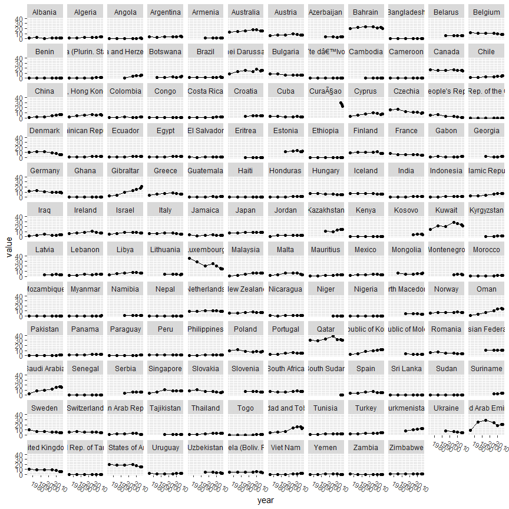
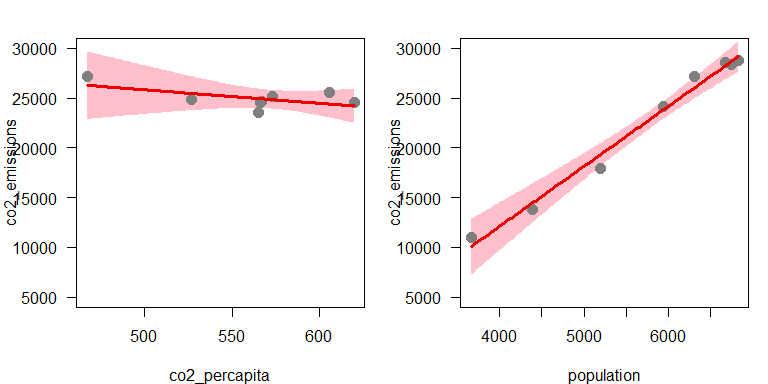
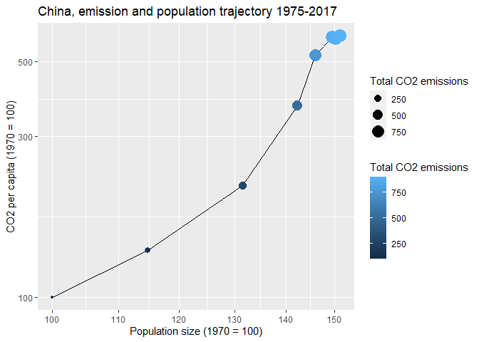
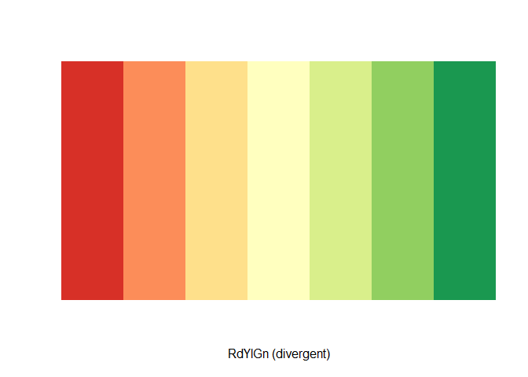
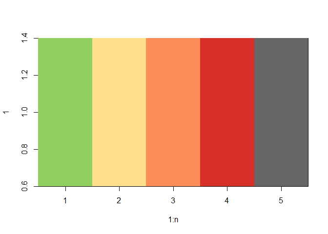
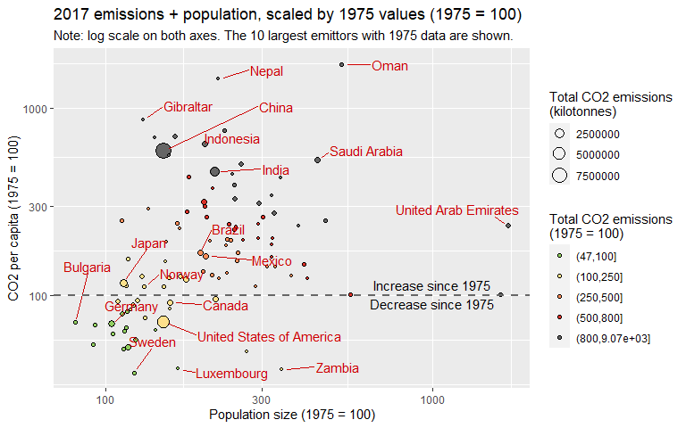
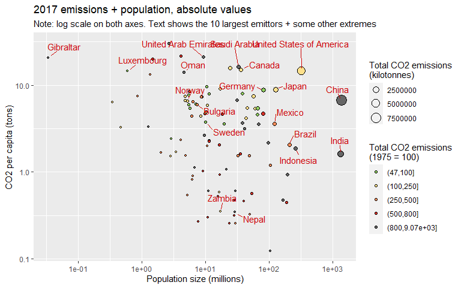
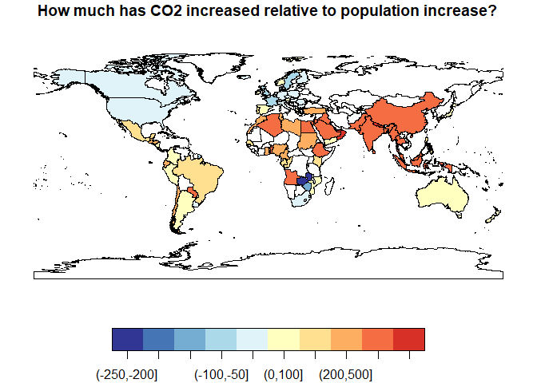
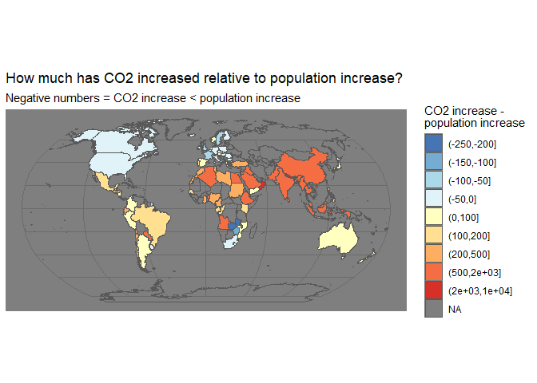
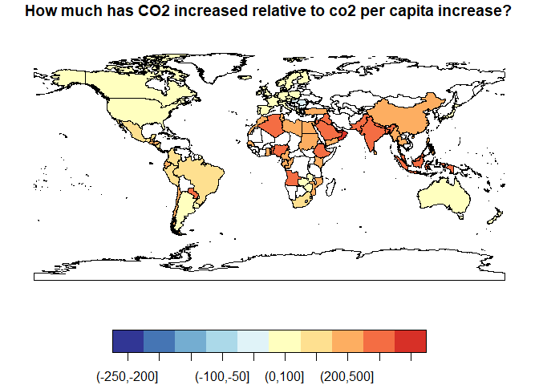

*Note*: to make the maps, you need to download a shapefile from https://www.naturalearthdata.com/    

* Either use [this link](https://www.naturalearthdata.com/http//www.naturalearthdata.com/download/50m/cultural/ne_50m_admin_0_countries.zip)   

* Or go to the [downloads page](https://www.naturalearthdata.com/downloads) and follow this path:   
    - Medium scale data, 1:50m -> Cultural -> Admin 0 – Countries

## Packages 


### Function for displaying colors  

```r
display_col <- function(colors){
  n <- length(colors)
  image(1:n, 1, as.matrix(1:n), col = colors)
}
```


## Data set 'Env_Dataset_UNdata' CO2 emissions    

* Denoted as data set ´dat3a´   


```r
dat3a <- read.csv("Env_Dataset_UNdata/Carbon Dioxide Emission Estimates.csv") %>%
  clean_names()

dat3a$series %>% table()  

dat3a %>%
  filter(series == "Emissions per capita (metric tons of carbon dioxide)") %>%
  ggplot(aes(year, value)) + 
  geom_point() +
  geom_line() +
  facet_wrap(vars(co2_emission_estimates)) +
  easy_rotate_labels("x", angle = -30)
```

<!-- -->

```
## .
##   Emissions (thousand metric tons of carbon dioxide) 
##                                                 1066 
## Emissions per capita (metric tons of carbon dioxide) 
##                                                 1066
```

## CO2 increase and population increase  

### Get data and population size per year  

```r
dat3a_all <- read.csv("Env_Dataset_UNdata/Carbon Dioxide Emission Estimates.csv") %>%
  clean_names() %>%
  rename(
    Country = co2_emission_estimates
  ) %>%
  # Put data on "wide" format:
  pivot_wider(names_from = "series", values_from = "value") %>%
  rename(
    co2_emissions = `Emissions (thousand metric tons of carbon dioxide)`,
    co2_percapita = `Emissions per capita (metric tons of carbon dioxide)`
  ) %>%
  mutate(
    co2_emissions = co2_emissions/1000,
    population = co2_emissions / co2_percapita 
  )
```

### Countries with data in all years    
* Selected countries represents well over 90% of global population   

```r
tab <- xtabs(~Country + year, dat3a_all)

# apply(tab>0, 1, sum)  
# apply(tab>0, 2, sum)  

# Pick the countries which have data in all 8 years  
tab_sel <- tab[apply(tab>0, 1, sum) == 8,]
selected_countries <- rownames(tab_sel)

cat("Number of countries selected: \n")
length(selected_countries)

cat("\n")
cat("Total population size (in millions) of countries selected: \n")
dat3a_all %>%
  filter(Country %in% selected_countries & year == 2017) %>%
  summarise(Total_pop = sum(population)) %>%
  pull(Total_pop)

cat("Total population size (in millions) of all countries: \n")
dat3a_all %>%
  filter(year == 2017) %>%
  summarise(Total_pop = sum(population)) %>%
  pull(Total_pop)
```

```
## Number of countries selected: 
## [1] 111
## 
## Total population size (in millions) of countries selected: 
## [1] 6829.035
## Total population size (in millions) of all countries: 
## [1] 7210.428
```

### Total for all countries   
Almost all increase in CO2 is *seemingly* explained by population increase   

```r
# Sum all numbers ('where(is.double)') for every year
dat_sum <- dat3a_all %>%
  filter(Country %in% selected_countries) %>%
  group_by(year) %>%
  dplyr::summarize(across(where(is.double), .fns = sum))

# Statistical model  
mod1 <- lm(co2_emissions ~ co2_percapita + population, dat_sum) 
# summary(mod1)

# Plot result of statistical model
par(mfrow = c(1,2), mar=c(4,4,2,1))
visreg(mod1, line=list(col="red2"),
                    fill=list(col="pink"),
                    points=list(cex=1.5, pch=19),
       ylim = c(5000,30000))
```

<!-- -->

```r
# Percent explained by population alone  
mod0 <- lm(co2_emissions ~ 1, dat_sum)
mod0a <- lm(co2_emissions ~ co2_percapita, dat_sum)
mod0b <- lm(co2_emissions ~ population, dat_sum)
res0 <- sum(mod0$residuals^2)
res0a <- sum(mod0a$residuals^2)
res0b <- sum(mod0b$residuals^2)
res1 <- sum(mod1$residuals^2)
cat("Percent explained by co2 per capita alone: \n")  
(res0 - res0a)/res0*100
cat("Percent explained by population alone: \n")  
(res0 - res0b)/res0*100
cat("Percent explained by population + co2 per capita: \n")  
(res0 - res1)/res0*100

cat("\nANOVA:\n")
anova(mod1)
```

```
## Percent explained by co2 per capita alone: 
## [1] 51.04619
## Percent explained by population alone: 
## [1] 98.1328
## Percent explained by population + co2 per capita: 
## [1] 98.51522
## 
## ANOVA:
## Analysis of Variance Table
## 
## Response: co2_emissions
##               Df    Sum Sq   Mean Sq F value    Pr(>F)    
## co2_percapita  1 161761519 161761519  171.90 4.607e-05 ***
## population     1 150425798 150425798  159.85 5.500e-05 ***
## Residuals      5   4705144    941029                      
## ---
## Signif. codes:  0 '***' 0.001 '**' 0.01 '*' 0.05 '.' 0.1 ' ' 1
```


### For China alone  

* Decided that a statistical model is overkill (we *know* that co2_emissions = population*co2_percapita)
* Calculate all values as percentage of the 1975 value (in other words, set 1975 = 100)  
* For China, the increase in CO2 is mostly due to the increase in *CO2 per capita*, *not* population increase    
* Note: coulnd to this on log scale, as then the 


```r
# Function for value as percentage of the first ()   
value_rel <- function(x) {x/head(x,1)*100}

dat_sel <- dat3a_all %>%
  filter(Country %in% "China") %>%
  dplyr::summarize(across(where(is.double), .fns = value_rel))
dat_sel

percap <- tail(dat_sel$co2_percapita,1)/tail(dat_sel$co2_emissions,1)
popsize <- tail(dat_sel$population,1)/tail(dat_sel$co2_emissions,1)

cat("'Fraction' of CO2 increased explained by per capita CO2 increase: \n ")
percap/(percap + popsize)
```

```
## # A tibble: 8 x 3
##   co2_emissions co2_percapita population
##           <dbl>         <dbl>      <dbl>
## 1          100           100        100 
## 2          158.          138.       115.
## 3          282.          214.       131.
## 4          525.          369.       142.
## 5          761.          521.       146.
## 6          884.          591.       150.
## 7          881.          585.       150.
## 8          899.          595.       151.
## 'Fraction' of CO2 increased explained by per capita CO2 increase: 
##  [1] 0.7972261
```

#### Trajectory for China  

```r
ggplot(dat_sel, aes(population, co2_percapita)) +
  geom_line() +
  geom_point(aes(size = co2_emissions, color = co2_emissions)) + 
  scale_color_gradient("Total CO2 emissions") +
  scale_size("Total CO2 emissions") +
  scale_x_log10() +
  scale_y_log10() +
  labs(
    x = "Population size (1970 = 100)",
    y = "CO2 per capita (1970 = 100)",
    title = "China, emission and population trajectory 1975-2017"
  )
```

<!-- -->


### For Sweden    

* CO decrease, while the population has increased  


```r
change_rel <- function(x) {(x - head(x,1))/head(x,1)*100}
value_rel <- function(x) {x/head(x,1)*100}

dat_sel <- dat3a_all %>%
  filter(Country %in% "Sweden") %>%
  dplyr::summarize(across(where(is.double), .fns = value_rel))
dat_sel
```

```
## # A tibble: 8 x 3
##   co2_emissions co2_percapita population
##           <dbl>         <dbl>      <dbl>
## 1         100           100         100 
## 2          73.9          72.5       102.
## 3          72.0          66.8       108.
## 4          62.1          56.4       110.
## 5          58.3          50.9       114.
## 6          47.0          39.2       120.
## 7          48.1          39.7       121.
## 8          47.6          38.8       123.
```

### For all countries    

* Works for countries where  both population size and co2 emissions has increased  
* For countries where co2 emissions has decreased (e.g. Sweden) it's not meaningful    
* This approach is abandoned  


```r
value_rel <- function(x) {x/head(x,1)*100}

spliteffects_one_country <- function(country){

  dat_sel <- dat3a_all %>%
    filter(Country %in% country) %>%
    dplyr::summarize(across(where(is.double), .fns = value_rel))
  
  result <- data.frame(
    Country = country,
    co2_emissions_rel = tail(dat_sel$co2_emissions,1),
    co2_percapita_rel = tail(dat_sel$co2_percapita,1),
    population_rel = tail(dat_sel$population,1)
  )
  
  result$percap_rat <- with(result, co2_percapita_rel/co2_emissions_rel)
  result$popsize_rat <- with(result, population_rel/co2_emissions_rel) 
  
  result$percap_perc <- with(result, percap_rat/(percap_rat + popsize_rat)*100)
  result$popsize_perc <- with(result, popsize_rat/(percap_rat + popsize_rat)*100)
  
  result
  
}

# test
spliteffects_one_country("China")
spliteffects_one_country("Sweden")

# For all countries   
spliteffects <- selected_countries %>% purrr::map_dfr(spliteffects_one_country)
```

```
##   Country co2_emissions_rel co2_percapita_rel population_rel percap_rat
## 1   China          899.4228          594.6572       151.2506  0.6611542
##   popsize_rat percap_perc popsize_perc
## 1   0.1681641    79.72261     20.27739
##   Country co2_emissions_rel co2_percapita_rel population_rel percap_rat
## 1  Sweden          47.62537          38.79158       122.7724   0.814515
##   popsize_rat percap_perc popsize_perc
## 1    2.577879    24.01004     75.98996
```

## CO2 increase and population increase - maps   

### Get map   

* Shapefile from https://www.naturalearthdata.com/  


```r
map_countries <- st_read("ne_50m_admin_0_countries/ne_50m_admin_0_countries.shp")
```

```
## Reading layer `ne_50m_admin_0_countries' from data source 
##   `C:\Data\Various-R\Visathon-R\ne_50m_admin_0_countries\ne_50m_admin_0_countries.shp' 
##   using driver `ESRI Shapefile'
## Simple feature collection with 242 features and 161 fields
## Geometry type: MULTIPOLYGON
## Dimension:     XY
## Bounding box:  xmin: -180 ymin: -89.99893 xmax: 180 ymax: 83.59961
## Geodetic CRS:  WGS 84
```

### Make 'dat3a_2017'   
* Contains   
    - emissions (total and per capita) for 2017  
    - scaled emissions (total and per capita) + population for 2017 (all scaled to 1975 = 100)      
    - difference between total scaled emissions and total scaled population     
    - difference between total scaled emissions and total scaled per capita emissions       

```r
# dat3a %>%
#   filter(series == "Emissions (thousand metric tons of carbon dioxide)") %>% xtabs(~year, .) 

# 2017 only  
dat3a_2017 <- read.csv("Env_Dataset_UNdata/Carbon Dioxide Emission Estimates.csv") %>%
  clean_names() %>%
  filter(year == 2017) %>%
  rename(
    Country = co2_emission_estimates
  ) %>%
  pivot_wider(names_from = "series", values_from = "value") %>%
  rename(
    co2_emissions_2017 = `Emissions (thousand metric tons of carbon dioxide)`,
    co2_percapita_2017 = `Emissions per capita (metric tons of carbon dioxide)`
  ) %>%
  mutate(
    population_2017 = co2_emissions_2017 / co2_percapita_2017 /1000
  )   


# All years, on wide format  
dat3a_wide <- read.csv("Env_Dataset_UNdata/Carbon Dioxide Emission Estimates.csv") %>%
  clean_names() %>%
  rename(Country = co2_emission_estimates) %>%
  pivot_wider(names_from = "series", values_from = "value") %>%
  rename(
    co2_emissions = `Emissions (thousand metric tons of carbon dioxide)`,
    co2_percapita = `Emissions per capita (metric tons of carbon dioxide)`
  ) %>%
  mutate(
    co2_emissions = co2_emissions/1000,
    population = co2_emissions / co2_percapita
  ) 
  

# Function for getting 2017 value (tail) relative to
#   1975 value (head)
value_rel_2017 = function(x) {tail(x,1)/head(x,1)*100}

# Get relative values  
dat3a_addition <- dat3a_wide %>%  
  filter(Country %in% selected_countries) %>%
  arrange(Country, year) %>%
  group_by(Country) %>%
  dplyr::summarize(across(where(is.double), 
                          .fns = value_rel_2017,
                          .names = "{.col}_scaled"), 
                   .groups = "drop") %>%
  # Add difference  
  mutate(
    co2_dev_population = co2_emissions_scaled - population_scaled,
    co2_dev_percapita = co2_emissions_scaled - co2_percapita_scaled
    )

# 
dat3a_2017 <- dat3a_2017 %>%
  mutate(
    NAME = case_when(
      grepl("Brunei", Country) ~ "Brunei",
      grepl("Bolivia", Country) ~ "Bolivia",
      grepl("Iran", Country) ~ "Iran",
      grepl("Tanzania", Country) ~ "Tanzania",
      grepl("Venezuela", Country) ~ "Venezuela",
      grepl("Viet Nam", Country) ~ "Vietnam",
      grepl("Moldova", Country) ~ "Moldova",
      grepl("Syria", Country) ~ "Syria",
      grepl("Ivoire", Country) ~ "Côte d'Ivoire",
      grepl("Bosnia", Country) ~ "Bosnia and Herz.",
      grepl("Syria", Country) ~ "Syria",
      Country == "Russian Federation" ~ "Russia",
      Country == "Republic of Korea" ~ "South Korea",
      Country == "Dem. People's Rep. Korea" ~ "North Korea",
      Country == "Dem. Rep. of the Congo" ~ "Dem. Rep. Congo",
      Country == "South Sudan" ~ "S. Sudan",
      TRUE ~ Country)
  ) %>%
  left_join(dat3a_addition, by = c("NAME" = "Country"))

dat3a_2017 %>%
  arrange(desc(co2_emissions_2017)) %>% 
  head(10) %>%
  select(Country, co2_emissions_2017, co2_emissions_scaled)   


# keep only those with data
dat3a_2017 <- dat3a_2017 %>%
  filter(!is.na(co2_emissions_scaled))  
```

```
## # A tibble: 10 x 3
##    Country                    co2_emissions_2017 co2_emissions_scaled
##    <chr>                                   <dbl>                <dbl>
##  1 China                                9257934.                899. 
##  2 United States of America             4761302.                109. 
##  3 India                                2161567.                995. 
##  4 Russian Federation                   1536879.                 NA  
##  5 Japan                                1132435.                133. 
##  6 Germany                               718794.                 73.8
##  7 Republic of Korea                     600034.                 NA  
##  8 Iran (Islamic Republic of)            567123.                 NA  
##  9 Canada                                547799.                145. 
## 10 Saudi Arabia                          532182.               2363.
```


```r
dat3a_2017$co2_emissions_scaled %>% quantile()  
dat3a_2017$co2_emissions_scaled %>% quantile(seq(0,1,0.15))  

display.brewer.pal(7, name = "RdYlGn")
```

<!-- -->

```r
cols <- rev(RColorBrewer::brewer.pal(7, name = "RdYlGn")[c(1:3,6)])
cols <- c(cols, "grey40")
display_col(cols)
```

<!-- -->

```
##         0%        25%        50%        75%       100% 
##   47.62537  135.29141  407.58239  779.36585 9068.80815 
##         0%        15%        30%        45%        60%        75%        90% 
##   47.62537   99.53206  167.01387  330.74830  511.98683  779.36585 1158.08733
```


### Plot scaled emissions + population for 2017   

```r
# Find intervals for color scale 
# dat3a_2017$co2_emissions_scaled %>% quantile()  
# dat3a_2017$co2_emissions_scaled %>% quantile(seq(0,1,0.15))  

# display.brewer.all()
# cols <- rev(RColorBrewer::brewer.pal(11, name = "RdYlGn")[1:7])
#display_col(cols)

dat_countries_with_labels <- bind_rows(
  # The 10 biggest emittors in 2017
  dat3a_2017 %>% arrange(co2_emissions_2017) %>% tail(10),
  # The top 3 with biggest increase in per capita CO2  
  dat3a_2017 %>% arrange(co2_percapita_scaled) %>% tail(3),
  # The top 3 with biggest decrease in per capita CO2
  dat3a_2017 %>% arrange(co2_percapita_scaled) %>% head(3),
  # The top 1 with biggest increase in population size  
  dat3a_2017 %>% arrange(population_scaled) %>% tail(1),
  # The top 1 with biggest decrease in population size  
  dat3a_2017 %>% arrange(population_scaled) %>% head(1),
  # Norway
  dat3a_2017 %>% filter(Country == "Norway")
)

dat3a_2017 %>%
  # Change co2_emissions_scaled for continuous to categorized, for color scale:
  mutate(co2_emissions_scaled = cut(co2_emissions_scaled, breaks = c(47,100,250,500,800,9069))) %>%
  # Plotting:
  ggplot(aes(population_scaled, co2_percapita_scaled, group = Country)) +
  geom_point(aes(size = co2_emissions_2017, fill = co2_emissions_scaled), pch = 21) + 
  scale_size("Total CO2 emissions\n(kilotonnes)") +
  scale_fill_manual("Total CO2 emissions\n(1975 = 100)", values = cols) + 
  scale_x_log10() +
  scale_y_log10() +
  geom_text_repel(
    data = dat_countries_with_labels,
    aes(label = Country), color = "red3",
    box.padding = .6, point.padding = 0.5, min.segment.length = 0, nudge_x = 0.15, nudge_y = 0.05
  ) +
  geom_hline(yintercept = 100, linetype = "dashed", size = 1, color = "grey40") +
  annotate("text", x = rep(1000,2), y = rep(100,2), 
           label = c("Increase since 1975", "Decrease since 1975"),
           vjust = c(-0.5, 1.2)) +
  labs(
    x = "Population size (1975 = 100)",
    y = "CO2 per capita (1975 = 100)",
    title = "2017 emissions + population, scaled by 1975 values (1975 = 100)",
    subtitle = "Note: log scale on both axes. Text shows the 10 largest emittors + some other extremes"
  )
```

<!-- -->

```r
# hjust = 0, nudge_x = 0.01, 
```

### Plot unscaled emissions + population for 2017   

```r
# Find intervals for color scale 
# dat3a_2017$co2_emissions_scaled %>% quantile()  
# dat3a_2017$co2_emissions_scaled %>% quantile(seq(0,1,0.15))  

# display.brewer.all()
# cols <- rev(RColorBrewer::brewer.pal(11, name = "RdYlGn")[1:7])
#display_col(cols)

dat_countries_with_labels <- bind_rows(
  # The 10 biggest emittors in 2017
  dat3a_2017 %>% arrange(co2_emissions_2017) %>% tail(10),
  # The top 3 with biggest increase in per capita CO2  
  dat3a_2017 %>% arrange(co2_percapita_scaled) %>% tail(3),
  # The top 3 with biggest decrease in per capita CO2
  dat3a_2017 %>% arrange(co2_percapita_scaled) %>% head(3),
  # The top 1 with biggest increase in population size  
  dat3a_2017 %>% arrange(population_scaled) %>% tail(1),
  # The top 1 with biggest decrease in population size  
  dat3a_2017 %>% arrange(population_scaled) %>% head(1),
  # Norway
  dat3a_2017 %>% filter(Country == "Norway")
)

dat3a_2017 %>%
  mutate(co2_emissions_scaled = cut(co2_emissions_scaled, breaks = c(47,100,250,500,800,9069))) %>%
  ggplot(aes(population_2017, co2_percapita_2017, group = Country)) +
  geom_point(aes(size = co2_emissions_2017, fill = co2_emissions_scaled), pch = 21) + 
  scale_size("Total CO2 emissions\n(kilotonnes)") +
  scale_fill_manual("Total CO2 emissions\n(1975 = 100)", values = cols) + 
  scale_x_log10() +
  scale_y_log10() +
  geom_text_repel(
    data = dat_countries_with_labels,
    aes(label = Country), color = "red3",
    box.padding = .6, point.padding = 0.5, min.segment.length = 0, nudge_x = 0.15, nudge_y = 0.05
  ) +
  labs(
    x = "Population size (millions)",
    y = "CO2 per capita (tons)",
    title = "2017 emissions + population, absolute values",
    subtitle = "Note: log scale on both axes. Text shows the 10 largest emittors + some other extremes"
  )
```

<!-- -->

```r
# hjust = 0, nudge_x = 0.01, 
```

## Make map data  

```r
map_emissions <- map_countries %>%
  select(NAME) %>%
  left_join(dat3a_2017, by = "NAME") %>%
  select(-Country)


# Check country names  
n1 <- unique(dat3a_2017$NAME)
n2 <- map_emissions %>% filter(!is.na(co2_emissions_2017)) %>% pull(NAME)
n3 <- map_emissions %>% pull(NAME)

# Check country names in CO2 data not found in map data 
n1[!n1 %in% n2]  
```

```
## [1] "China, Hong Kong SAR" "Dominican Republic"   "Gibraltar"
```


### Save as Shape and GeoJSON  

```r
foldername <- "map_emissions"
dir.create(foldername)
```

```
## Warning in dir.create(foldername): 'map_emissions' already exists
```

```r
# Shape
sf::write_sf(map_emissions, paste0(foldername, "/emissions_changes.shp"))
```

```
## Warning in abbreviate_shapefile_names(obj): Field names abbreviated for ESRI
## Shapefile driver
```

```r
# GeoJSON
sf::write_sf(map_emissions, paste0(foldername, "/emissions_changes.GeoJSON"))
```

```
## Warning in CPL_write_ogr(obj, dsn, layer, driver,
## as.character(dataset_options), : GDAL Error 6: DeleteLayer() not supported by
## this dataset.
```

## Plot CO2 emission changes      

### Increase relative to population increase

```r
mapdata <- read_sf("nc_emissions_2017F/emissions_changes.GeoJSON")

var <- "co2_dev_population"
quantile(mapdata[[var]], na.rm = TRUE)  

brks <- c(-250, -200, -150, -100, -50, 0, 100, 200, 500, 2000, 10000)
mapdata$col1 <- cut(mapdata[[var]], 
                   breaks = brks)

# RColorBrewer::brewer.pal(11, name = "RdYlBu")

plot(mapdata["col1"], pal = rev(RColorBrewer::brewer.pal(11, name = "RdYlBu")),
     main = "How much has CO2 increased relative to population increase?")
```

<!-- -->

```
##          0%         25%         50%         75%        100% 
## -205.723833   -8.661087  135.315376  434.527529 8543.089447
```

#### Plot as ggplot


```r
# perform transformation on modified version of world dataset
mapdata2 <- st_transform(mapdata, 
                               crs = '+proj=robin +lon_0=0 +x_0=0 +y_0=0 +ellps=WGS84 +datum=WGS84 +units=m +no_defs')

gg <- ggplot(mapdata2) +
  geom_sf(aes(fill = col1)) +
  scale_fill_brewer("CO2 increase -\npopulation increase", palette = "RdYlBu", direction = -1) +
  labs(title = "How much has CO2 increased relative to population increase?",
       subtitle = "Negative numbers = CO2 increase < population increase") +
  theme_dark()
  
ggsave("co_rel_popul.png", gg, width = 12, height = 9, dpi = 400)

gg
```

<!-- -->


### Increase relative to per capita CO2 increase   

```r
mapdata <- read_sf("nc_emissions_2017F/emissions_changes.GeoJSON")

var <- "co2_dev_percapita"
#quantile(mapdata[[var]], na.rm = TRUE)  

brks <- c(-250, -200, -150, -100, -50, 0, 100, 200, 500, 2000, 10000)
mapdata$col2 <- cut(mapdata[[var]], 
                   breaks = brks)

# RColorBrewer::brewer.pal(11, name = "RdYlBu")

plot(mapdata["col2"], pal = rev(RColorBrewer::brewer.pal(11, name = "RdYlBu")),
     main = "How much has CO2 increased relative to co2 per capita increase?")
```

<!-- -->

#### Plot as ggplot


```r
# perform transformation on modified version of world dataset
mapdata2 <- st_transform(mapdata, 
                               crs = '+proj=robin +lon_0=0 +x_0=0 +y_0=0 +ellps=WGS84 +datum=WGS84 +units=m +no_defs')

gg <- ggplot(mapdata2) +
  geom_sf(aes(fill = col2)) +
  scale_fill_brewer("CO2 increase -\npopulation increase", palette = "RdYlBu", direction = -1) +
  labs(title = "How much has CO2 increased relative to co2 per capita increase?",
       subtitle = "Negative numbers = CO2 increase < population increase") +
  theme_dark()

ggsave("co_rel_procap.png", gg, width = 12, height = 9, dpi = 400)

gg
```

<!-- -->


