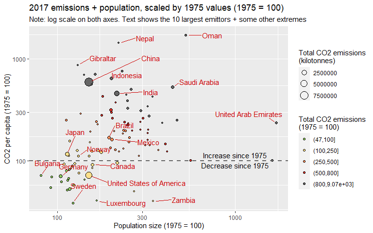
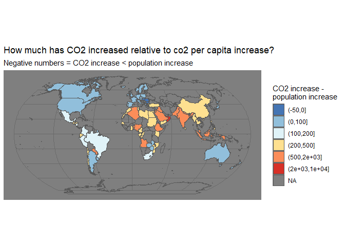

# Visathon-R

R code for the VISATHON day, team MMA (Mordor Mapping Authority)   

* Script 01  
    - Just a look at a couple of data sets  

* Script 02
    - Some plots/maps of CO2 emission data by country 1975-2017  
    - See [result file](02_Visualising_CO2_emissions.md)  
 
   
   
